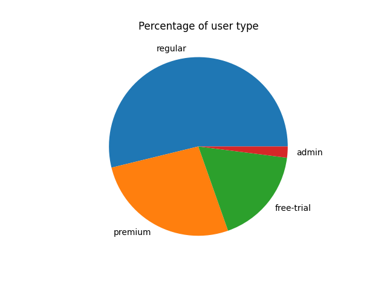

# Findings of Mini E-Commerce Analytics Project

## User Type Counts
The most common user from this site is a regular user with 3513 users. This is 53.8% of all users.
The second most common user is premium with 1735 users. This makes up 26.6% of all users.
The third most common user is free-trial with 1148 users. This makes up 17.6% of all users
The least common user is admin with 132 users. Finally, this makes up a whopping 2.02% of all users.

This is the pie chart that illustrates these findings.

## Top 10 Spenders
When querying for the top 10 users that spend the most, I discovered that Sia Vanfaye has spent the most with a total of $58,900.40 followed closely by Eva Fay with $57,329.22. All top 10 users were above the $50,000.00 threshold (Thats insane!)

When observing the total distribution of revenue across all users, there is practically no users remotely close to that 50k mark but yet there is at least 10 from this query. Most users spent between the 0 and 10k region.

## Device Distribution
The most used device from our users information is windows, with 1669 users. The second is ios with 1635 users, third is unknown with 1625 users, and lastly android with 1599. The distribution between the devices is pretty even with each taking about 25% of the total. 

The visualization for this distribution was.

## Top 5 Category by Revenue
The category with the most sales if fruniture, pulling in $6609420.54 in sales. This is followed by electronis with $3636963.91 in total sales. Then home appliances with $3387198.79 in sales. Then sport equipment with $2806779.43 in sales. And finally footwear with $669192.14 in sales. 

This is the bar chart that showcases revenue by category.

## Monthly Revenue Trend (2023-2024)
The last thing that was analyzed with the query was the revenue monthly over 2023 and 2024. 
It appears at the beginning of 2023 there was a slight drop, an increase over the the first half of 2023 until a steep decline in July of 2023. Then some ups and downs until June of 2024 when it finally started to trend upwards again through the end of 2024.

